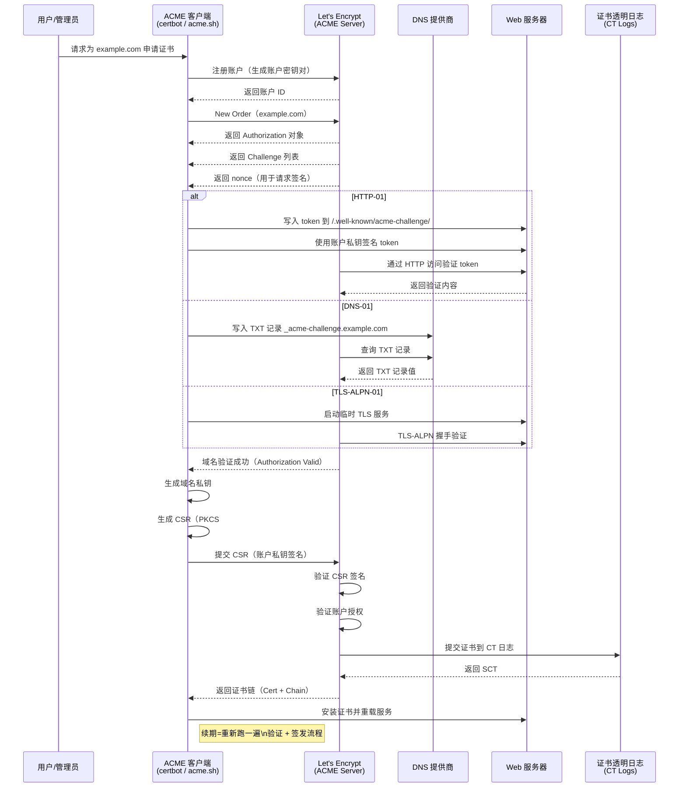

[https://letsencrypt.org/how-it-works/](https://letsencrypt.org/how-it-works/)

```mermaid
sequenceDiagram
    participant User as 用户/管理员
    participant Client as ACME 客户端<br/>(certbot / acme.sh)
    participant LE as Let's Encrypt<br/>(ACME Server)
    participant DNS as DNS 提供商
    participant Web as Web 服务器
    participant CT as 证书透明日志<br/>(CT Logs)

    %% 1. 创建 ACME 账户
    User->>Client: 请求为 example.com 申请证书
    Client->>LE: 注册账户（生成账户密钥对）
    LE-->>Client: 返回账户 ID

    %% 2. 创建订单
    Client->>LE: New Order（example.com）
    LE-->>Client: 返回 Authorization 对象
    LE-->>Client: 返回 Challenge 列表
    LE-->>Client: 返回 nonce（用于请求签名）

    %% 3. 域名控制验证
    alt HTTP-01
        Client->>Web: 写入 token 到 /.well-known/acme-challenge/
        Client->>Web: 使用账户私钥签名 token
        LE->>Web: 通过 HTTP 访问验证 token
        Web-->>LE: 返回验证内容
    else DNS-01
        Client->>DNS: 写入 TXT 记录 _acme-challenge.example.com
        LE->>DNS: 查询 TXT 记录
        DNS-->>LE: 返回 TXT 记录值
    else TLS-ALPN-01
        Client->>Web: 启动临时 TLS 服务
        LE->>Web: TLS-ALPN 握手验证
    end

    LE-->>Client: 域名验证成功（Authorization Valid）

    %% 4. 提交 CSR 并签发证书
    Client->>Client: 生成域名私钥
    Client->>Client: 生成 CSR（PKCS#10）
    Client->>LE: 提交 CSR（账户私钥签名）
    LE->>LE: 验证 CSR 签名
    LE->>LE: 验证账户授权
    LE->>CT: 提交证书到 CT 日志
    CT-->>LE: 返回 SCT
    LE-->>Client: 返回证书链（Cert + Chain）

    %% 5. 安装与续期
    Client->>Web: 安装证书并重载服务
    Note right of Client: 续期=重新跑一遍\n验证 + 签发流程

```