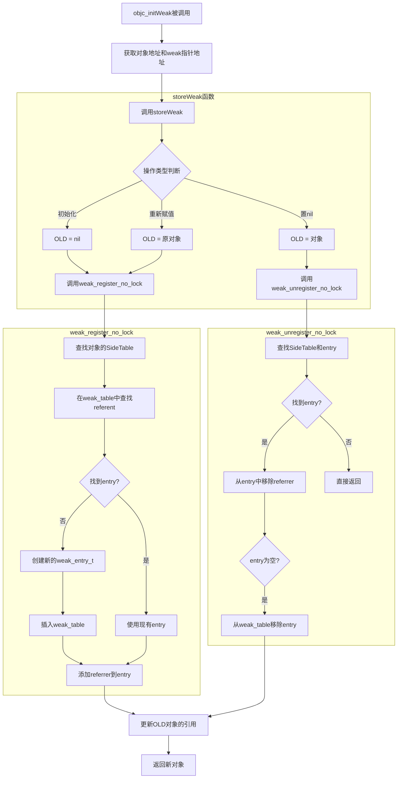
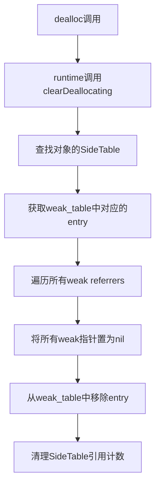
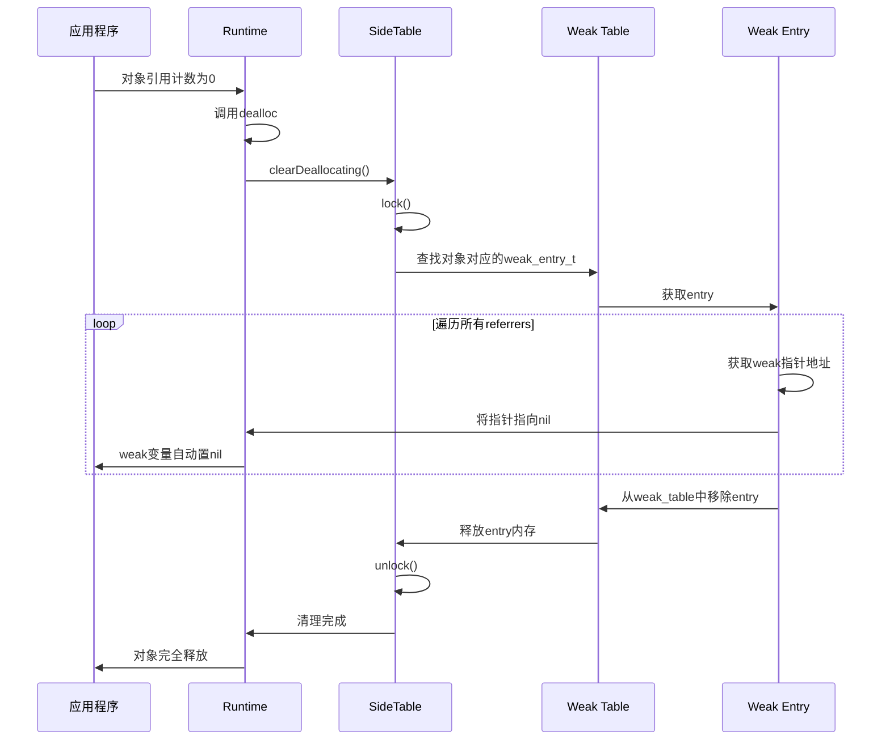
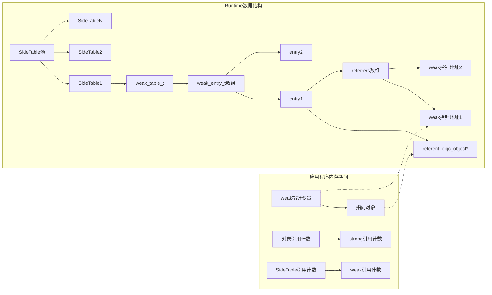

## Weak 引用核心数据结构

### 1. weak_referrer_t

```c
// The address of a __weak variable.
// These pointers are stored disguised so memory analysis tools
// don't see lots of interior pointers from the weak table into objects.
typedef DisguisedPtr<objc_object *> weak_referrer_t;
```
这是 weak 变量的地址类型，使用 `DisguisedPtr` 进行封装，以避免内存分析工具将其识别为从 weak 表到对象的内部指针。

### 2. weak_entry_t

```c
/**
 * The internal structure stored in the weak references table. 
 * It maintains and stores
 * a hash set of weak references pointing to an object.
 * If out_of_line_ness != REFERRERS_OUT_OF_LINE then the set
 * is instead a small inline array.
 */
#define WEAK_INLINE_COUNT 4

// out_of_line_ness field overlaps with the low two bits of inline_referrers[1].
// inline_referrers[1] is a DisguisedPtr of a pointer-aligned address.
// The low two bits of a pointer-aligned DisguisedPtr will always be 0b00
// (disguised nil or 0x80..00) or 0b11 (any other address).
// Therefore out_of_line_ness == 0b10 is used to mark the out-of-line state.
#define REFERRERS_OUT_OF_LINE 2

struct weak_entry_t {
    DisguisedPtr<objc_object> referent;
    union {
        struct {
            weak_referrer_t *referrers;
            uintptr_t        out_of_line_ness : 2;
            uintptr_t        num_refs : PTR_MINUS_2;
            uintptr_t        mask;
            uintptr_t        max_hash_displacement;
        };
        struct {
            // out_of_line_ness field is low bits of inline_referrers[1]
            weak_referrer_t  inline_referrers[WEAK_INLINE_COUNT];
        };
    };

    bool out_of_line() {
        return (out_of_line_ness == REFERRERS_OUT_OF_LINE);
    }

    weak_entry_t& operator=(const weak_entry_t& other) {
        memcpy(this, &other, sizeof(other));
        return *this;
    }

    weak_entry_t(objc_object *newReferent, objc_object **newReferrer)
        : referent(newReferent)
    {
        inline_referrers[0] = newReferrer;
        for (int i = 1; i < WEAK_INLINE_COUNT; i++) {
            inline_referrers[i] = nil;
        }
    }
};
```

这是存储在 weak 引用表中的内部结构，包含：
- `referent`：被弱引用的对象
- 联合体：
  - 当 `out_of_line_ness == REFERRERS_OUT_OF_LINE` 时，使用外部哈希表存储弱引用
  - 否则，使用内联数组（最多 4 个元素）存储弱引用

### 3. weak_table_t

```c
/**
 * The global weak references table. Stores object ids as keys,
 * and weak_entry_t structs as their values.
 */
struct weak_table_t {
    weak_entry_t *weak_entries;
    size_t    num_entries;
    uintptr_t mask;
    uintptr_t max_hash_displacement;
};
```

这是全局 weak 引用表，包含：
- `weak_entries`：weak_entry_t 数组，作为哈希表的存储
- `num_entries`：当前表中的条目数量
- `mask`：哈希表的掩码，用于计算索引
- `max_hash_displacement`：最大哈希位移，用于处理哈希冲突

### 4. WeakRegisterDeallocatingOptions

```c
enum WeakRegisterDeallocatingOptions {
    ReturnNilIfDeallocating,
    CrashIfDeallocating,
    DontCheckDeallocating
};
```

这是注册 weak 引用时的选项枚举，用于指定当对象正在 dealloc 时的行为。

## Weak 表查找和添加详细流程



## 对象释放时 weak 清理流程





## Weak 引用的内存管理细节


