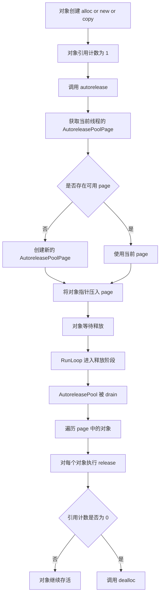

```mermaid
flowchart TD
    A[对象创建 alloc or new or copy] --> B[对象引用计数为 1]

    B --> C[调用 autorelease]
    C --> D[获取当前线程的 AutoreleasePoolPage]

    D --> E{是否存在可用 page}
    E -- 否 --> F[创建新的 AutoreleasePoolPage]
    E -- 是 --> G[使用当前 page]

    F --> H[将对象指针压入 page]
    G --> H

    H --> I[对象等待释放]

    I --> J[RunLoop 进入释放阶段]
    J --> K[AutoreleasePool 被 drain]

    K --> L[遍历 page 中的对象]
    L --> M[对每个对象执行 release]

    M --> N{引用计数是否为 0}
    N -- 否 --> O[对象继续存活]
    N -- 是 --> P[调用 dealloc]
```