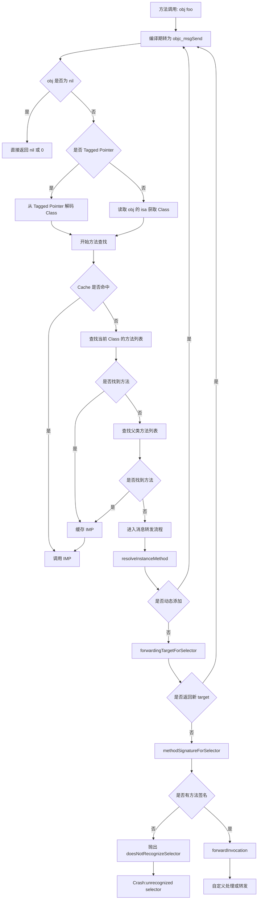

## NSMethodSignature

```objc
@interface NSMethodSignature : NSObject

+ (nullable NSMethodSignature *)signatureWithObjCTypes:(const char *)types;

@property (readonly) NSUInteger numberOfArguments;
- (const char *)getArgumentTypeAtIndex:(NSUInteger)idx NS_RETURNS_INNER_POINTER;

@property (readonly) NSUInteger frameLength;

- (BOOL)isOneway;

@property (readonly) const char *methodReturnType NS_RETURNS_INNER_POINTER;
@property (readonly) NSUInteger methodReturnLength;

@end
```

`NSMethodSignature` 是“一次方法调用在内存层面的完整调用说明书”。
它精确描述了：
* 返回值类型和大小
* 每个参数的类型、大小、对齐方式
* 参数个数
* 调用约定（隐含的 `self`、`_cmd`）

可以按如下理解
* SEL = 方法名
* IMP = 函数指针
* NSMethodSignature = 函数的 ABI 描述
* NSInvocation = 已填好参数的函数调用包

如果找到了IMP，就执行，如果没找到IMP，就得想办法把当前正在执行的方法抛出去给用户/业务逻辑决策。而如何抛，就需要用NSInvocation构造一下，交给forwardInvocation。如何构造，就需要根据NSMethodSignature来决定。

## 三次补救
### Method Resolution
实例方法：`resolveInstanceMethod:`
类方法：`resolveClassMethod:`，若仍无IMP，则调用一次`resolveInstanceMethod:`兜底
作用：允许开发者在运行时动态添加方法

### Fast Forwarding
指定一个备用接受者，将当前消息原封不动地转发给它。

### Normal Forwarding
开发者可在`forwardInvocation:`中自由处理，忽略也可以。

### 为什么这么设计？
* 毕竟是参考的Smalltalk，在Smalltalk里就可以将消息转发给别人。
* Composition over Inheritance / 组合优于继承
* Objc的核心不是class，而是selector。语言不关心谁实现，在哪实现，是否在编译时就实现，更关心谁来响应。优先不更改invocation，谁能处理就先处理掉，处理不了再看能不能修改invocation等（就像领导拍板了一个任务发给下面🤣）。结构性转发 > 行为级拦截。


